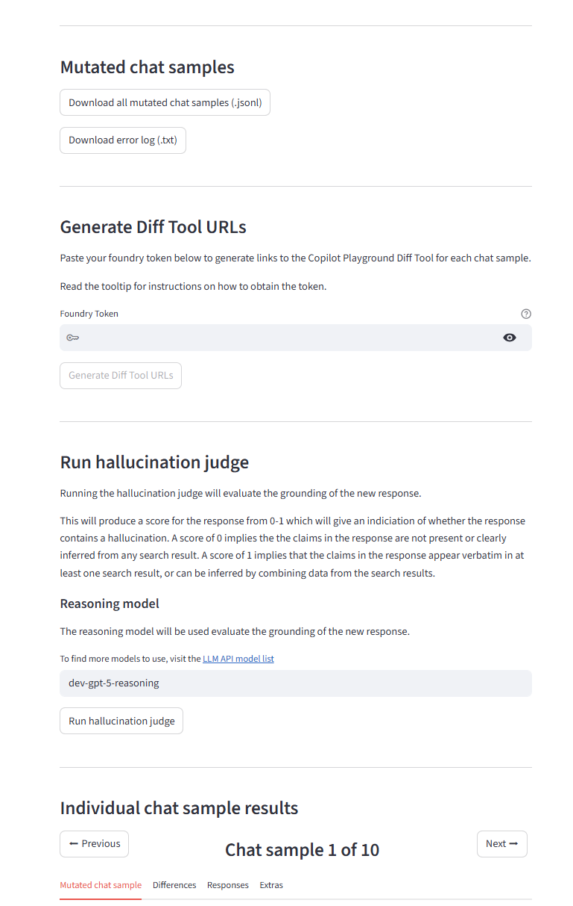

# chat-mutator

**chat-mutator** is a Python-based *synthetic chat-data mutation* framework for stress-testing how chat-based LLMs behave when their conversational context is systematically perturbed. It takes multi-turn chat samples (JSONL), applies a selected “mutation” (predefined or custom), re-generates the assistant response using a configurable model backend, and then produces analysis artifacts to help you understand how the mutation impacted the model’s grounding and output quality.

The repository ships with two primary workflows:

- **Interactive Streamlit app** for uploading/pasting chat samples, selecting mutation types (and optional customizations), choosing the model used for mutation + response generation, and reviewing/exporting results (mutated samples, error logs, per-sample diff links, and an optional grounding/hallucination judge).
- **Reproducible headless runner (CLI + YAML config)** for batch experiments (mirroring four experimental conditions A–D) that processes “frozen” samples, writes generations to a results directory, and aggregates summary + per-mutation metrics (e.g., `metrics_overall.json`, `metrics_by_mutation.json`, and `tokens_latency.csv`).

There are also utilities to **convert Hugging Face datasets into frozen JSONL samples** (e.g., WebGPT and HotpotQA) so experiments can be reproduced deterministically.


## Install dependencies
- Install Python version 3.12 on your system
- Create a virtual environment in the workspace:
  - On Windows, run:
    ```powershell
    py -3.12 -m venv .venv
    ```
  - On Unix or MacOS, run:
    ```powershell
    python3.12 -m venv .venv
    ```

- Activate the virtual environment
  - On Windows, run:
    ```powershell
    .venv\Scripts\activate.bat
    ```
  - On Unix or MacOS, run:
    ```powershell
    source .venv/bin/activate.bat
    ```
- Install dependencies from `requirements.txt`
  
  ```powershell
  pip install -r requirements.txt
  ```

## Run the Streamlit app
To run the Streamlit app, enter the following command:

```powershell
streamlit run .\chat_mutator_app.py
```
The termimal should display a message indicating that you can now view the Streamlit app in your browser. Navigate to the `Local URL` listed below that message.

## Headless runner

The repository also ships with a reproducible, headless runner that mirrors the paper's four experimental conditions (A–D). To launch the smoke-test configuration run:

```powershell
python tools/runner.py --config configs/exp_pilot.yaml
```

This command processes the frozen samples in `data/samples/pilot.jsonl`, writes model generations to `results/exp_pilot/samples.jsonl`, and aggregates metrics in `metrics_overall.json`, `metrics_by_mutation.json`, and `tokens_latency.csv`.

## Convert Hugging Face datasets into frozen samples

The conversion script in `tools/build_hf_datasets.py` reproduces the WebGPT and HotpotQA processing used in our experiments.

1. Install the optional dependencies:

   ```powershell
   pip install -r requirements.huggingface.txt
   ```

2. Run the converter, specifying which dataset to export (`webgpt`, `hotpot`, or `all`). The example below writes the default 1,000-sample subsets to `data/`:

   ```powershell
   python -m tools.build_hf_datasets all
   ```

   Use `--split`, `--limit`, `--seed`, or `--output-dir` to override the Hugging Face split, adjust the deterministic sample size, or change the destination directory. Invoke `python -m tools.build_hf_datasets --help` to see the full CLI reference.

### Interpreting outputs

Open `results/exp_pilot/metrics_overall.json` to review the Attributed Accuracy (AAd), ACE, and other headline numbers for the run. Per-mutation breakdowns are stored in `metrics_by_mutation.json`, and token/latency accounting lives in `tokens_latency.csv`.

## Use the Synthetic Chat-Data Mutation Framework
1. Upload a JSONL file of chat samples, or copy and paste the chat samples into the text area.
2. Select a predefined mutation type, or write your own mutation request.
    - Some predefined mutation types provide the option to select a customisation.
    - The combinations of mutation type + customisation selection that are performed using an LLM will allow you to view and edit its system prompt and user query.
3. Choose which model you would like to use to perform the mutations and generate the new responses from the mutated chat samples. The default model is the recommended production model.
4. The system prompt and parameters that are used during response generation are available to view and edit.
5. Click **Submit**.


## View results
It may take some time for the chat samples to be processed and for the results to appear, but once they do you will be able to do the following:
- Download all mutated chat samples with their new responses
- Download an error log to explain if any chat samples failed the mutation process.
- Generate links to the Copilot Playground Diff Tool for each chat sample to be able to see the difference highlighting.
- Run a judge which will give a score to evaluate the grounding of the new response given the mutated context.
- Click through each chat sample individually for a more detailed analysis. To see the info in the 'Extras' tab for each chat sample, the Diff Tool URLs must already be generated and the hallucination judge must be run.





## Acknowledgements
Significant portion of this code was developed by Jess Peck during her internship at Microsoft.