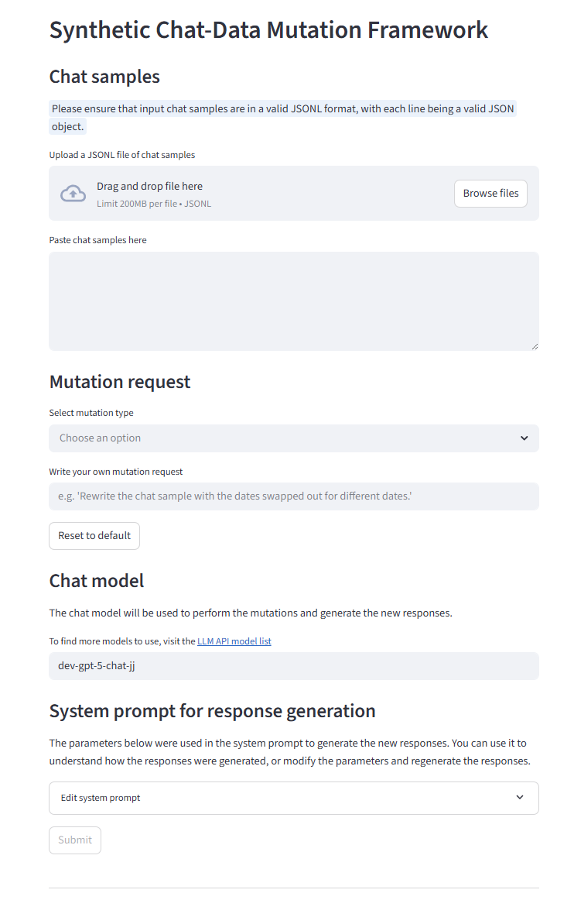

# chat-dsat-mutator
[Work in Progress]
## Install dependencies
- Install Python version 3.12 on your system
- Create a virtual environment in the workspace:
  - On Windows, run:
    ```powershell
    py -3.12 -m venv .venv
    ```
  - On Unix or MacOS, run:
    ```powershell
    python3.12 -m venv .venv
    ```

- Activate the virtual environment
  - On Windows, run:
    ```powershell
    .venv\Scripts\activate.bat
    ```
  - On Unix or MacOS, run:
    ```powershell
    source .venv/bin/activate.bat
    ```
- Install dependencies from `requirements.txt`
  
  ```powershell
  pip install -r requirements.txt
  ```

## Run the Streamlit app
To run the Streamlit app, enter the following command:

```powershell
streamlit run .\chat_dsat_mutator_app.py
```
The termimal should display a message indicating that you can now view the Streamlit app in your browser. Navigate to the `Local URL` listed below this message.

## Use the Synthetic Chat-Data Mutation Framework
1. Upload a JSONL file of chat samples, or copy and paste the chat samples into the text area.
2. Select a predefined mutation type, or write your own mutation request.
3. Choose which model you would like to perform the mutations and generate new responses from the mutated chat samples.
4. Click **Submit**.


